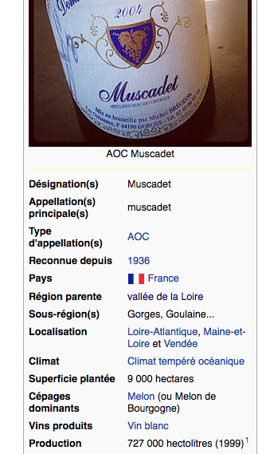
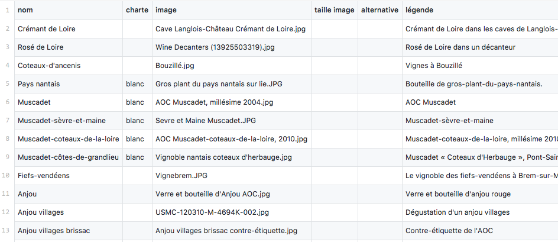

OpenWines Open-Data scraper
===========================

OpenWines scraper, is a simple Command Line Interface to scrap 100% genuine open-data,
in order to generate fixtures dataset for OpenWines Products Information Manager.

## What is does

It scraps Wikipedia, and put nice data in a CSV, like this [list of wine appellations](output/appellations.csv).

It turns these infoboxes:



into this [26 columns CSV file](output/appellations.csv):



## What is is

It's a simple command line application, heavily inspired by [Cilex](https://github.com/Cilex/Cilex).
It parses Wikipedia infoboxes – the right block of structured data in a wikipedia page – and put these templated data in a CSV file.
It uses an [infobox definition from Wikipedia](config/Resources/Appellations/InfoboxModel/FR_Infobox_Region_viticole.yml) found [here](https://fr.wikipedia.org/wiki/Mod%C3%A8le:Infobox_R%C3%A9gion_viticole) and a [CSV list of appellations from Wikipedia](config/Sources/FR_AOC.csv).

## How to install it

 1. `git clone` _this_ repository.
 2. Download composer: `curl -s https://getcomposer.org/installer | php`
 3. Install dependencies: `php composer.phar install`


## How to use it

Command option examples:

```bash
bin/scraper appellation > output/appellations.csv  
bin/scraper appellation muscadet > output/muscadet.csv
```

Output examples: 

 - (all listed) [appellations.csv](output/appellations.csv)
 - (1 appellation:) [muscadet.csv](output/muscadet.csv)

These commands use 

 - an [infobox definition from Wikipedia](config/Resources/Appellations/InfoboxModel/FR_Infobox_Region_viticole.yml) found [here](https://fr.wikipedia.org/wiki/Mod%C3%A8le:Infobox_R%C3%A9gion_viticole)
 - a [CSV list of appellations from Wikipedia](config/Sources/FR_AOC.csv)

Other available commands:

```bash
bin/scraper 
bin/scraper info
bin/scraper help appellation
bin/scraper appellation muscadet
```

## How to hack it

 - Create your new commands in `src/OpenWines/Command/`
 - Add your new commands to `bin/`
 - Add new Wikipedia infobox models [here](config/Resources/Appellations/InfoboxModel/)
 - Add more URLs to scrape [here](config/Sources/) (need to make it a parameter, no done already)

## How to package it (in a PHAR)

 - Download and install [box][5]:
```sh
curl -LSs https://box-project.github.io/box2/installer.php | php
chmod +x box.phar
mv box.phar /usr/local/bin/box
```
 - Update the project phar config in box.json
 - Create the package:
```sh
box build
```
 - Run the commands:
```sh
./scraper.phar info
```
 - enjoy a lot.

## How to reuse it

OpenWines Scraper is licensed under the [Open Software License (OSL 3.0)](http://opensource.org/licenses/osl-3.0.php)

[1]: http://symfony.com
[2]: http://silex.sensiolabs.org
[3]: http://cilex.github.com/get/cilex.phar
[4]: http://cilex.github.com/documentation
[5]: https://box-project.github.io/box2/

## FAQ

Q: How do I pass configuration into the application?

A: You can do this by adding the following line, where $configPath is the path to the configuration file you want to use:

```php
$app->register(new \OpenWines\Provider\ConfigServiceProvider(), array('config.path' => $configPath));
```

The formats currently supported are: YAML, XML and JSON